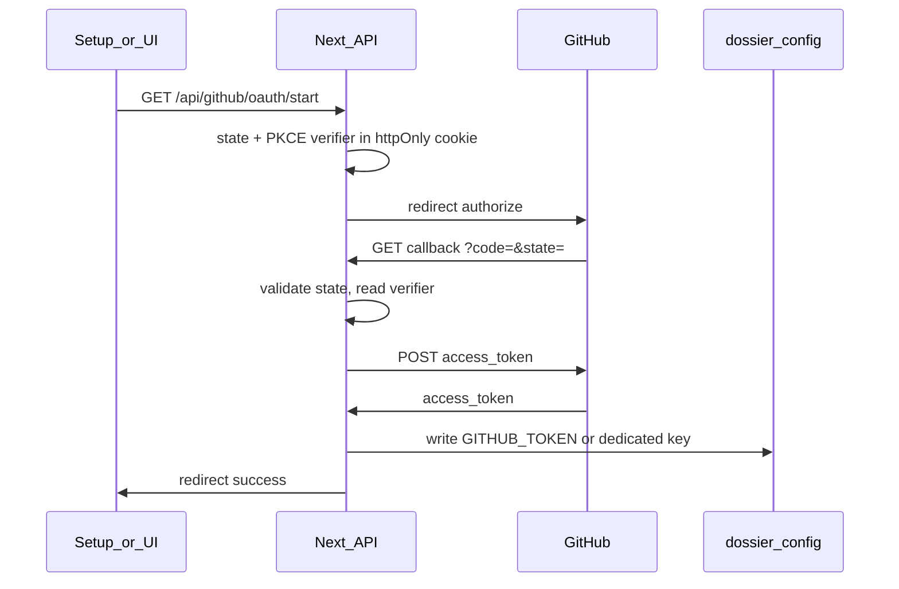

# GitHub OAuth for Dossier

## Reality check (product / security)

- **OAuth removes manual PAT creation**, not "keyless" API access. After consent, GitHub issues an **OAuth user access token** (`gho_...`). Existing code paths that send `Authorization: Bearer …` or embed the token in an HTTPS git URL keep working unchanged at the HTTP layer.
- **Scopes**: For private repos, list/create repos, clone/fetch/push over HTTPS, request scope **`repo`** (see [Scopes for OAuth apps](https://docs.github.com/en/apps/oauth-apps/building-oauth-apps/scopes-for-oauth-apps)). Narrower `public_repo` only if you explicitly drop private-repo support.
- **Org / SSO**: Some orgs require extra approval or SAML SSO authorization for tokens; document that as a support edge case.
- **Storage**: Today [`lib/config/data-dir.ts`](lib/config/data-dir.ts) writes `~/.dossier/config` with mode `0o600`. OAuth tokens should use the same store (or a dedicated key) and never be logged.

## GitHub-side prerequisites (manual / CI)

1. **Register a GitHub OAuth App** (not a GitHub App unless you later want installation-based permissions): [New OAuth App](https://github.com/settings/applications/new).
2. **Callback URL**: Use a **loopback** URL so Electron's variable port is supported. GitHub documents that for loopback, the **`redirect_uri` port may differ** from the registered callback as long as host/path rules match ([Redirect URLs — loopback](https://docs.github.com/en/apps/oauth-apps/building-oauth-apps/authorizing-oauth-apps#loopback-redirect-urls)). Register something like `http://127.0.0.1:3000/api/github/oauth/callback`; at runtime pass the **actual** server port (from `NEXT_PUBLIC_DOSSIER_PORT`, request host, or Electron's chosen port).
3. **Enable Device flow** in the OAuth app settings if you add the optional device-flow path ([Device flow](https://docs.github.com/en/apps/oauth-apps/building-oauth-apps/authorizing-oauth-apps#device-flow)).
4. **Client secret**: For server-side token exchange with PKCE, follow GitHub's current guidance: many setups still use `client_secret` for the web flow; **PKCE** is strongly recommended ([changelog](https://github.blog/changelog/2025-07-14-pkce-support-for-oauth-and-github-app-authentication/)). For **device flow**, `client_secret` is **not** used. Ship **`GITHUB_OAUTH_CLIENT_ID`** everywhere; keep **`GITHUB_OAUTH_CLIENT_SECRET`** only in dev/self-hosted `.env.local` (avoid baking into public desktop builds if you standardize on PKCE-only + device flow for packaged apps).

## Current code touchpoints (single token abstraction)

All of these read `GITHUB_TOKEN` from env or `readConfigFile()`:

| Area                 | File                                                                                                                                                                               |
| -------------------- | ---------------------------------------------------------------------------------------------------------------------------------------------------------------------------------- |
| Clone/fetch/push     | [`lib/orchestration/repo-manager.ts`](lib/orchestration/repo-manager.ts) — `getGitHubToken()`, `repoUrlToCloneUrl()`, `pushBranch()`                                               |
| List/create repos    | [`app/api/github/repos/route.ts`](app/api/github/repos/route.ts)                                                                                                                   |
| Setup gate           | [`middleware.ts`](middleware.ts), [`app/api/setup/status/route.ts`](app/api/setup/status/route.ts)                                                                                 |
| Persist keys from UI | [`app/api/setup/route.ts`](app/api/setup/route.ts), [`app/setup/page.tsx`](app/setup/page.tsx), [`components/dossier/api-keys-dialog.tsx`](components/dossier/api-keys-dialog.tsx) |
| Repo picker / sync UX | [`components/dossier/left-sidebar.tsx`](components/dossier/left-sidebar.tsx) — GitHub section, connect-repo dialog, `/api/github/repos` errors |

**PRs on GitHub**: Orchestration stores **PR candidates in SQLite**; there is **no** `POST .../repos/.../pulls` integration yet. OAuth does not change that unless you add API-based PR creation later.

## Architecture

1. **Centralize token resolution** in a small module (e.g. `lib/github/resolve-github-token.ts`): return token from `process.env.GITHUB_TOKEN` first, then config file (OAuth-written or legacy PAT). Update [`repo-manager.ts`](lib/orchestration/repo-manager.ts) and [`app/api/github/repos/route.ts`](app/api/github/repos/route.ts) to import it—**one source of truth**.
2. **OAuth routes** (new under `app/api/github/oauth/`):
   - **`start`**: Generate `state` + PKCE `code_verifier` / `code_challenge` (S256 only). Store verifier + state in a short-lived **httpOnly, Secure (when HTTPS), SameSite=Lax** cookie (or encrypted session blob). Redirect to `https://github.com/login/oauth/authorize` with `client_id`, `scope=repo`, `redirect_uri` (dynamic loopback URL matching current port + path), `state`, `code_challenge`, `code_challenge_method=S256`.
   - **`callback`**: Validate `state`, read verifier, `POST https://github.com/login/oauth/access_token` with `Accept: application/json`, `client_id`, `code`, `redirect_uri`, `code_verifier`, and per your deployment `client_secret` if required. On success: optional `GET https://api.github.com/user` to confirm identity, then `writeConfigFile({ GITHUB_TOKEN: access_token })` (or `GITHUB_OAUTH_ACCESS_TOKEN` + merge in resolver—your choice; simplest is **reuse `GITHUB_TOKEN`** so the rest of the app stays unchanged).
3. **CSRF / open redirects**: Strictly validate `state`; only allow `redirect_uri` values under `127.0.0.1` with your fixed path prefix (and same for public deploy hostname if you add non-loopback later).
4. **Optional: Device flow** (strong fit for "no browser callback" and simpler secret handling): `POST /login/device/code` → show `user_code` in UI → server polls `POST /login/oauth/access_token` with `grant_type=urn:ietf:params:oauth:grant-type:device_code` → write token. Requires enabling device flow on the OAuth app. Expose as second button on setup ("Authorize on another device") or fallback when loopback fails.

## Dossier UX/UI (GitHub auth)

Use existing patterns: `Button`, `Dialog`, `Label`, `Input`, `toast` (where the sidebar already uses it), and the same spacing/typography as [`app/setup/page.tsx`](app/setup/page.tsx) and [`components/dossier/api-keys-dialog.tsx`](components/dossier/api-keys-dialog.tsx). No new auth framework (e.g. NextAuth); flows stay first-party routes + redirects.

### Setup ([`app/setup/page.tsx`](app/setup/page.tsx))

- **Primary path**: Prominent **Connect GitHub** (or **Sign in with GitHub**) that navigates to `GET /api/github/oauth/start` (full navigation so the browser follows the 302 to GitHub). Short inline note while OAuth is in progress: e.g. "You'll return here after authorizing on GitHub."
- **Advanced / fallback**: Collapsible or secondary **Use a personal access token instead** with the existing field and `repo` scope help—covers CI, restricted environments, or users who refuse OAuth.
- **Connected state**: Show **GitHub connected** and optional **@login** from a new `GET /api/github/user` (uses resolved token). Actions: **Reconnect** (repeat OAuth; overwrite token) and **Disconnect** / **Remove token** (clear stored credential via a small API route—define semantics so env-injected CI tokens are not accidentally cleared).
- **Errors**: OAuth callback redirects to e.g. `/setup?github_error=…` with values like `access_denied`, `server`, `invalid_state` (no secrets in query). Setup reads params and shows friendly copy + **Try again**.
- **Dev**: If `GITHUB_OAUTH_CLIENT_ID` is missing, show a clear developer-facing message instead of a broken redirect.

### API keys dialog ([`components/dossier/api-keys-dialog.tsx`](components/dossier/api-keys-dialog.tsx))

- Mirror setup: **Connect GitHub** primary; PAT under **Advanced**.
- **Status**: When configured, show **Configured** and optional **@login** from `/api/github/user`.
- **Save**: PAT path unchanged; OAuth does not require paste—**Connect** runs the flow. After OAuth return, refetch status or refresh so the dialog shows connected.

### OAuth return / callback landing

- **Success**: Redirect to `/setup?github=connected` or `/` with a one-time toast ("GitHub connected"). If the user started from the keys dialog, use a query flag or `return_to` (validated, same-origin only) so the app can reopen the dialog or toast in context.
- Avoid a blank page: prefer redirect into existing shell + toast.

### Left sidebar — GitHub ([`components/dossier/left-sidebar.tsx`](components/dossier/left-sidebar.tsx))

- **503 / missing token** from `/api/github/repos`: Copy like **GitHub isn't connected** + **Connect GitHub** (same start URL) and/or **Open API keys** (wire from parent if needed).
- **401**: **Session expired or revoked** + **Reconnect**.
- **Connect repository** dialog: Update "Your GitHub token is used only on the server" to cover **OAuth or token**; link revocation to [authorized OAuth apps](https://github.com/settings/applications) / per-app URL with `NEXT_PUBLIC_GITHUB_OAUTH_CLIENT_ID` when available.

### Optional device flow UI

- Panel with **user code** (copyable), link to `https://github.com/login/device`, spinner **Waiting for authorization…**; client polls or server notifies when the token is stored; then same success feedback as the web flow.

### Accessibility and polish

- Visible focus on controls; errors not color-only; align with existing `destructive` / `muted-foreground` patterns.

### In-app copy

- Mention requested scopes (`repo`), that credentials live under `~/.dossier/config`, and how to **revoke** on GitHub.

## Electron / port alignment

- [`electron/main.ts`](electron/main.ts) picks the first free port from 3000 upward. **Loopback redirect rules** mean you can pass `redirect_uri` with the **actual** `serverPort` once the server is listening. Ensure the OAuth `start` handler knows the public origin: e.g. pass `?port=` from the client (trusted only on loopback) or set `NEXT_PUBLIC_DOSSIER_ORIGIN` / read `Host` from the incoming request to `start`.
- Document for contributors: OAuth app callback registration vs dynamic `redirect_uri` behavior.

## Config / docs

- [`.env.example`](.env.example): `GITHUB_OAUTH_CLIENT_ID=`, optional `GITHUB_OAUTH_CLIENT_SECRET=`, optional `GITHUB_OAUTH_REDIRECT_PATH=/api/github/oauth/callback` (full URL built from request).
- [`docs/reference/configuration-reference.md`](docs/reference/configuration-reference.md) and [`README.md`](README.md): OAuth vs PAT.
- New short ADR (optional): "GitHub auth via OAuth App + PAT fallback."

## Testing

- Unit/integration tests with mocked `fetch` for GitHub token and user endpoints; cookie `state`/PKCE validation.
- Extend [`__tests__/setup/credential-oauth.test.ts`](__tests__/setup/credential-oauth.test.ts) or add sibling tests: setup status still passes when `GITHUB_TOKEN` is set (PAT or OAuth-written).
- Manual: authorize → list repos → clone/push path on a private test repo.

## Out of scope (unless you explicitly want them)

- **GitHub App** with fine-grained repo selection (different product model, installation tokens).
- **Automatic PR creation** via GitHub REST API (not present today).
- **Token refresh**: Classic OAuth user tokens often do not expire unless you opt into expiring tokens; if you enable that in GitHub settings, add refresh handling in a follow-up.
