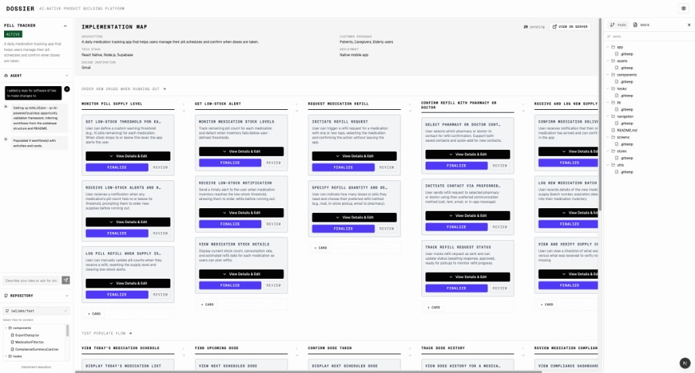
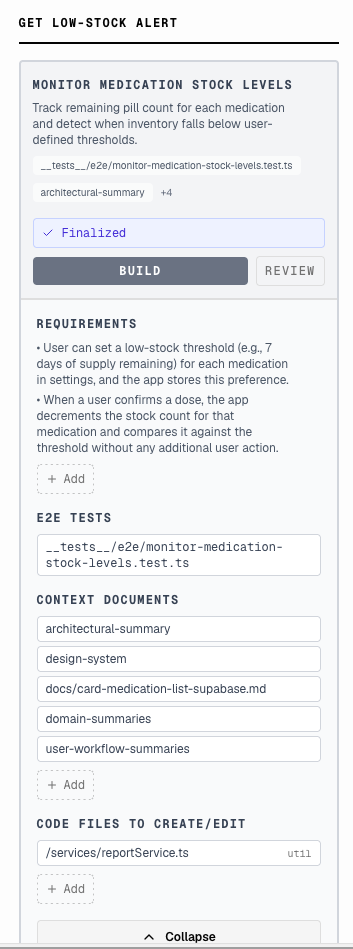
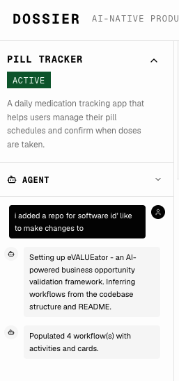
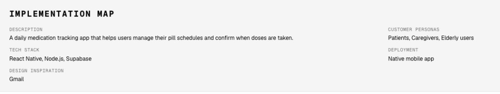
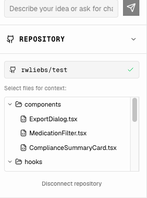
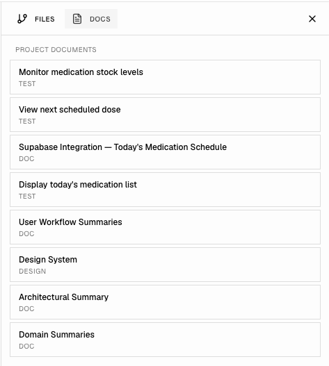

# DOSSIER

**Out of the weeds. Back to crafting products.**

Dossier is an AI-native product building platform. It gives you a living map of your entire product — structured, visible, and agent-ready — so you can stay focused on the product vision while your agents build the details.

You've learned to build with AI. Dossier is what comes next.

---

## The problem it solves

The tools that got you here worked fine — until the project got real.

Now you're juggling ten chat windows, losing track of what's done and what's broken, pasting context into every new prompt, and watching agents confidently build the wrong thing. The build is ballooning. Consistency is slipping. You're spending more time managing the process than shaping the product.

This isn't a tool problem. It's a scale problem. And it's the natural inflection point Dossier is built for.

---

## How it works

Dossier structures your product into a hierarchical map — **Product → Workflow → Feature card** — and attaches a rich context card to every piece. Workflows describe the user's perspective; feature cards describe how the software will work. Each card holds the facts, assumptions, and questions that matter for that feature. When you dispatch an agent, it gets precisely the context it needs. Nothing more, nothing less.

- **See it.** Your whole product, laid out. Orientation returns the moment you open it.
- **Trust it.** Structured context means agents stay on track. Builds become more consistent than you're used to.
- **Ship it.** Real product, delivered — not a prototype that loses the thread halfway through.
- **Tell someone.** Consistent shipping is still rare enough to share.

---

## The interface

### The product map — your entire build at a glance



The user story map is the core of Dossier. Workflows run left to right, feature cards stack beneath them. Every card shows its status. Your agents show their activity in the left panel in real time. The whole product is always visible — you never lose the forest for the trees.

### The context card — precision context for every feature



Every feature has a card. Before an agent touches a feature, the card holds what it needs to know: requirements, linked test files, context documents, and the code files it should create or edit. You review and approve. Then you build. The agent receives only what's relevant — focused context is what separates a clean implementation from a hallucinated one.

### The agent panel — real-time visibility into what's being built



Watch your agents work. The agent panel surfaces activity, reasoning, and completion status in real time. No more pasting into a black box and hoping. You see what's happening and you stay in control.

### Project details — vision and context at the product level



Every product has a top-level brief: description, tech stack, customer personas, deployment target, design inspiration. This context flows down through every workflow and feature card. Agents always know what they're building and for whom.

### Repository integration — your codebase, connected



Connect a GitHub repository (optional) and select files for context. Agents can write files locally; GitHub is required only when you want to open PRs. Dossier maps your product structure directly onto your codebase. Agents know which files to touch, which to leave alone, and how the pieces fit together.

### Context documents — everything that informs the build



Add and edit project documents by asking the agent in chat (e.g. architectural summaries, design systems, domain knowledge, test specs). Direct editing in the UI is coming later. Dossier surfaces the right documents to the right agent at the right time. Context isn't lost between sessions.

---

## Architecture

Dossier separates three distinct layers of state:

| Layer | What it contains | Storage |
|-------|------------------|---------|
| **Product structure** | Product → Workflow → Feature card hierarchy, rich context cards | Database |
| **Workflow state** | Attempt status, agent logs, execution history | Database |
| **Code state** | Branches, commits, file changes | Git (feature branches per attempt) |

The product structure layer is Dossier's differentiator. This is where your vision lives, where context accumulates, and where you shape what gets built.

### Data model

```
Product
└── Workflow (many)           — user's perspective (journey, actions)
    └── Feature card (many)   — how the software will work
        ├── Card (1:1)
        │   ├── Facts           — known truths about this feature
        │   ├── Assumptions     — working beliefs to validate
        │   ├── Questions       — unresolved decisions
        │   ├── Context docs    — linked files and documents
        │   └── GeneratedPrompt — ready for agent dispatch
        └── Attempt (many)
            ├── Agent used
            ├── Prompt sent
            ├── Status          — pending | running | success | failed
            ├── Output / Diff
            └── Feedback
```

### Tech stack

| Layer | Technology |
|-------|------------|
| **Frontend** | React + TypeScript + Tailwind CSS (Next.js) |
| **Backend** | Node.js / TypeScript |
| **Database** | SQLite (local-first, `~/.dossier/dossier.db`) |
| **Agent support** | Cursor, Claude Code — agent-agnostic by design (agentic-flow) |
| **Isolation** | Feature branches per attempt |

---

## Quickstart

**One-shot run (Node 18+):**

```bash
npx dossier-agentic-product-planner-builder
```

**Or from source:**

```bash
git clone https://github.com/rwliebs/Dossier.git
cd Dossier
pnpm install        # or: npm install
pnpm run build
pnpm run dossier
```

Your browser will open to **http://localhost:3000**. First run creates `~/.dossier`.

On first run you'll be guided through API key setup, or navigate directly to `/setup`.

**Prerequisites:** Node.js 18+, [Anthropic API key](https://console.anthropic.com/). A [GitHub token](https://github.com/settings/tokens) with `repo` scope is needed only if you want agents to open PRs; agents can write files locally without it.

---

## Documentation and help

| Topic | Link |
|-------|------|
| **System architecture** | [docs/SYSTEM_ARCHITECTURE.md](docs/SYSTEM_ARCHITECTURE.md) |
| **Development** | [docs/development-reference.md](docs/development-reference.md) |
| **Testing** | [docs/testing-reference.md](docs/testing-reference.md) |
| **Configuration** | [docs/reference/configuration-reference.md](docs/reference/configuration-reference.md) |
| **API endpoints** | [docs/reference/api-endpoints.md](docs/reference/api-endpoints.md) |
| **Database schema** | [docs/reference/database-schema.md](docs/reference/database-schema.md) |
| **Full doc index** | [docs/README.md](docs/README.md) |

Configuration (API keys, GitHub token) can be set via the web UI at `/setup` or by editing `~/.dossier/config`. See [.env.example](.env.example) for all options.

---

## What's built

- **Product map:** Create and edit projects; add workflows and feature cards; manage cards with requirements, facts, assumptions, questions, and linked context.
- **Planning agent:** Chat to infer workflows from a connected repo and README; populate the map with activities and cards.
- **Approval:** Per-card approve with generated context packages and E2E test specs; planned files and context documents attached to cards.
- **Build orchestration:** Trigger builds per card or workflow; feature branches per attempt; agentic-flow execution; run status, checks, and PR lifecycle (GitHub optional for local file writes).
- **Repository integration:** Connect a GitHub repo (optional); select files for context; file tree and diff status in the UI.
- **Context documents:** Add and edit FILES and DOCS via the agent in chat; surface to agents at build time. Direct editing in the UI is coming later.
- **Local-first:** All product and run state in SQLite under `~/.dossier/`; no data leaves your machine except via your Anthropic and (if used) GitHub connection.

---

## Roadmap (what's next)

- **Learning system** — Dossier surfaces warnings based on patterns from past builds (e.g. "agents commonly assume JWT auth but your project uses session cookies").
- **Multi-agent parallelization** — dispatch multiple agents across workflows simultaneously.
- **Cloud sync** — share products and context across teams.
- **Expanded agent support** — additional IDE and CLI agent integrations.

---

## Why not just build this yourself?

You could. That instinct — to build the infrastructure rather than use it — is exactly the trap Dossier is designed to free you from.

Dossier is the product of hard-won experience: a year of building seriously with AI agents, learning what actually controls quality at scale. Not what's promised in a demo. The patterns inside it — the context card structure, the layer-by-layer verification, the way prompts are generated from product hierarchy — took real iteration to get right. Building a version yourself puts you back in the weeds. Dossier gets you out of them.

---

## Contributing

Contributions are welcome. Open an issue to discuss what you'd like to change, or submit a pull request.

---

## License

MIT
